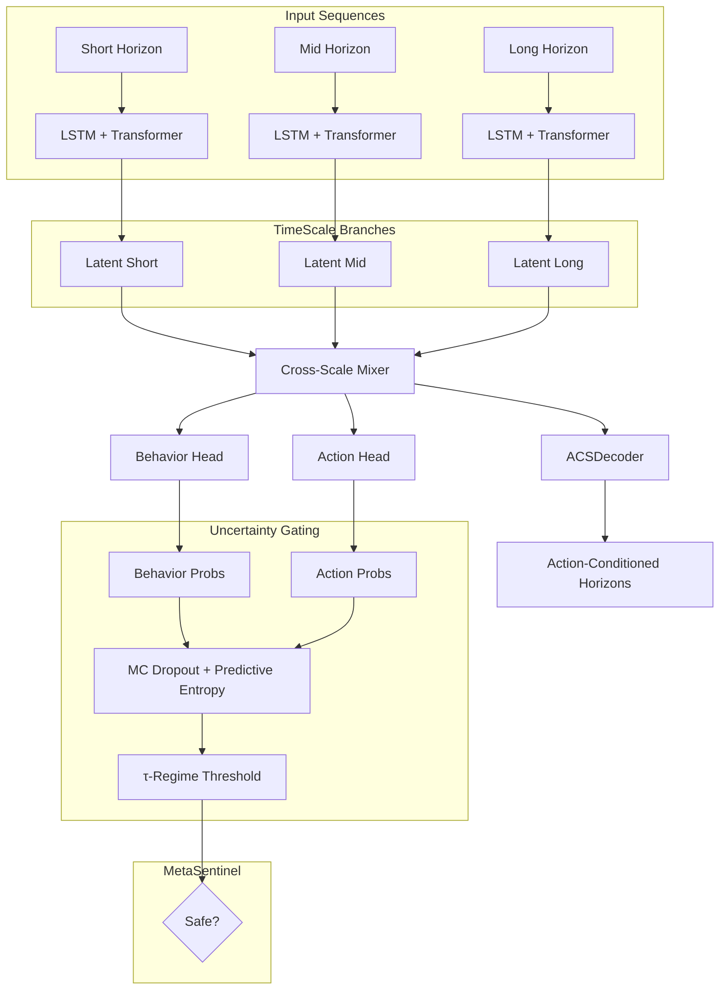

# 🌌 AstroMind-4D  

[](https://www.python.org/)  
[](https://pytorch.org/)  
[](./LICENSE)  
[]()  
[](./CONTRIBUTING.md)  
[](https://github.com/psf/black)  
[](https://github.com/Daniele-Cangi/AstroMind-4D/releases)  

**AstroMind-4D** is a **multi-horizon modeling framework** with **uncertainty gating, physics-aware loss, and drift detection**.  
It is designed to model **complex adaptive systems** across multiple domains — from finance and robotics to energy forecasting and biomedicine.  

---

## ✨ Key Features  

- **🌀 Multi-Scale Temporal Architecture**  
  The **AstraMind4DCore** integrates three dedicated processing branches for **short**, **medium**, and **long** horizons.  
  - Each branch combines **LSTM dynamics** with **Transformer encoders** and **positional encoding**.  
  - Outputs are fused via a **Cross-Scale Mixer**, ensuring coherent multi-horizon representation.  
  This enables the engine to **capture fine-grained and long-range dependencies simultaneously**.  

- **🔮 Behavioral & Action Heads**  
  The core produces two complementary probability distributions:  
  - **Behavior probabilities** — modeling latent agent/system states.  
  - **Action probabilities** — suggesting high-level strategies (e.g. hunt, hold, flee).  
  An **ACSDecoder (Action-Conditioned Simulation)** generates **multi-horizon counterfactual forecasts**, enabling “what-if” testing of interventions.  

- **🌐 Uncertainty Gating (Entropy + τ-Regimes)**  
  With **Monte Carlo Dropout**, AstroMind-4D estimates **predictive entropy** across multiple forward passes.  
  - Actions are only validated if confidence exceeds a regime-specific **τ-threshold**.  
  - Prevents **overconfident unstable predictions**, improving safety and robustness.  

- **⚖️ Physics-Aware Loss Functions**  
  Training includes **physics constraints**:  
  - Penalizes unrealistic changes per step.  
  - Supports optional volume smoothing.  
  This ensures simulations remain **realistic and physically plausible**.  

- **🛰️ MetaSentinel Drift Detection**  
  A continuous monitoring module that:  
  - Detects **distributional drift** (Kolmogorov–Smirnov test).  
  - Flags **entropy overload** situations.  
  - Outputs a **safety state** (`safe`, `drift`, `high_entropy`).  

- **🧪 Training & Pretraining Pipeline**  
  - Supports **weak-label pretraining**.  
  - Uses **AdamW** optimization with gradient clipping.  
  - Compatible with **offline backtesting** and **online adaptive tuning**.  

---

## 🧩 Architecture Overview  



---

## 📖 Why It Matters & Use Cases  

AstroMind-4D is built for **complex adaptive systems** where uncertainty, risk, and multi-horizon dependencies matter.  
Unlike standard models, it:  

- Learns **short-, mid-, and long-term dynamics** in parallel.  
- Embeds **uncertainty-aware gating** to reduce catastrophic decisions.  
- Integrates **physics-inspired constraints** for realistic outcomes.  
- Detects **drift and anomalies** before they destabilize predictions.  

### 🌍 Application Domains  

- 🤖 **Robotics & Autonomous Systems**  
  - Safe action selection in uncertain environments.  
  - Multi-step simulation for adaptive path planning and control.  

- 🧬 **Biomedicine & Healthcare**  
  - Patient monitoring with drift-aware anomaly detection.  
  - Adaptive treatment simulations with uncertainty thresholds.  

- ⚡ **Energy & IoT Forecasting**  
  - Multi-horizon load and demand prediction.  
  - Sensor anomaly detection in distributed networks.  

- 🛡️ **Cybersecurity**  
  - Detecting drift in network traffic and behavioral anomalies.  
  - Gating unsafe automated responses under uncertainty.  

- 🏭 **Industrial Control & Predictive Maintenance**  
  - Fault detection in machines with real-time entropy monitoring.  
  - Physics-constrained modeling of sensor and actuator dynamics.  

- 📈 **Finance & Economics**  
  - Modeling multi-agent behaviors (retail FOMO, whale stealth, institutional flow).  
  - Risk-aware strategy backtesting with τ-threshold gating.  

---

## 📂 Repository Structure  

```
astramind4d/
├── __init__.py          # Exports core modules
├── core.py              # Multi-scale architecture (branches + mixer + ACS)
├── gating.py            # MC dropout, entropy, τ-gating
├── losses.py            # Physics-aware loss functions
├── sentinel.py          # Drift detection
├── trainer.py           # Weak-label pretraining
├── example.py           # Usage demo
└── README.md
```

---

## ⚙️ Quickstart  

### 1. Install dependencies  
```bash
pip install torch==2.4.0 numpy scipy
```

### 2. Run the example  
```bash
python example.py
```

Sample output:  
```
Entropy: 0.37 Best: [1,0,2,1] Gate: [True, False, True, True]
Physics loss: 0.012
```

### 3. Integrate into your project  
```python
from astramind4d import AstraMind4DCore, mc_predict, select_action, MetaSentinel

model = AstraMind4DCore()
pb, pa, H = mc_predict(model, x_short, x_mid, x_long, passes=10)
best, scores, gate = select_action(out["acs"], H, tau=0.48)
sentinel = MetaSentinel()
status = sentinel.update(value=float(scores.max()), entropy=H)
```

---

## 🤝 Contributing  

We welcome contributions!  
Potential areas:  
- New **τ-maps** for regime-specific gating  
- Enhanced **physics constraints**  
- Domain-specific demos (robotics, healthcare, energy, finance)  

---

## 📜 License  

This project is licensed under the **Apache License 2.0**.  
See [LICENSE](./LICENSE) for details.  
