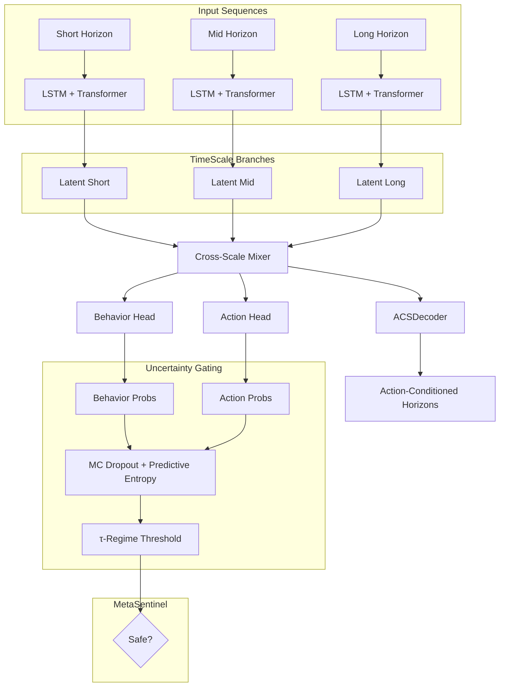

# 🌌 AstroMind-4D 
Physics-aware, uncertainty-gated framework for multi-horizon behavioral modeling.
[README.md](https://github.com/user-attachments/files/22233118/README.md)
 

[](https://www.python.org/)  
[](https://pytorch.org/)  
[](./LICENSE)  
[]()  
[](./CONTRIBUTING.md)  

**AstroMind-4D** is a **multi-scale, physics-aware, action-conditioned behavioral engine** with integrated **uncertainty gating**.  
It combines **temporal modeling, probabilistic filtering, and drift detection** to anticipate and stabilize complex behaviors across short, medium, and long time horizons.  

---

## ✨ Key Features  

- **🌀 Multi-Scale Temporal Architecture**  
  The **AstraMind4DCore** integrates three dedicated processing branches for **short**, **medium**, and **long** horizons.  
  - Each branch combines **LSTM dynamics** with **Transformer encoders** and **positional encoding** to capture fine-grained temporal dependencies.  
  - Outputs are fused via a **Cross-Scale Mixer**, ensuring consistent multi-horizon representation.  
  This design allows the engine to **understand and predict behaviors at different time granularities simultaneously**.  

- **🔮 Behavioral & Action Heads**  
  The core produces two complementary probability distributions:  
  - **Behavior probabilities** — predicting agent states (e.g. whale stealth, retail FOMO, institutional flow, algo predator, panic seller).  
  - **Action probabilities** — suggesting high-level strategies (hunt, hold, flee).  
  In addition, an **ACSDecoder (Action-Conditioned Simulation)** generates **multi-horizon forecasts**, enabling counterfactual “what-if” testing.  

- **🌐 Uncertainty Gating (Entropy + τ-Regimes)**  
  Using **Monte Carlo Dropout** with repeated forward passes, AstroMind-4D computes **predictive entropy** for both behaviors and actions.  
  - Actions are only accepted if confidence exceeds a regime-specific **τ-threshold**.  
  - Prevents **overconfident unstable predictions**, stabilizing decision-making.  

- **⚖️ Physics-Aware Loss Functions**  
  The training includes **physics loss** constraints:  
  - Penalizes unrealistic changes in predictions (e.g. excessive moves per time step).  
  - Optional volume smoothing to enforce continuity.  
  Ensures predictions remain **physically and economically plausible**.  

- **🛰️ MetaSentinel Drift Detection**  
  Continuously monitors for:  
  - **Distributional drift** (Kolmogorov–Smirnov test).  
  - **Entropy overload**, flagging unsafe uncertainty.  
  - Outputs a **safety flag** (`safe`, `drift`, `high_entropy`) to gate actions.  

- **🧪 Training & Pretraining Pipeline**  
  - Supports **pretraining with weak labels**.  
  - Optimized with **AdamW**, gradient clipping, and log-softmax stability.  
  - Suitable for both **offline backtesting** and **online adaptive tuning**.  

---

## 🧩 Architecture Overview  



---

## 📖 Why It Matters  

AstroMind-4D is built for **behavioral finance, complex systems, and adaptive control**.  
Unlike classical predictive models, it:  

- Learns **multi-horizon dynamics** instead of single-scale signals.  
- Embeds **uncertainty-aware gating** to prevent catastrophic overconfidence.  
- Integrates **physics constraints** for realism.  
- Detects **distribution shifts** before they corrupt predictions.  

---

## ⚙️ Quickstart  

### 1. Install dependencies  
```bash
pip install torch==2.4.0 numpy scipy
```

### 2. Run the example  
```bash
python example.py
```

Sample output:  
```
Entropy: 0.37 Best: [1,0,2,1] Gate: [True, False, True, True]
Physics loss: 0.012
```

### 3. Integrate into your project  
```python
from astramind4d import AstraMind4DCore, mc_predict, select_action, MetaSentinel

model = AstraMind4DCore()
pb, pa, H = mc_predict(model, x_short, x_mid, x_long, passes=10)
best, scores, gate = select_action(out["acs"], H, tau=0.48)
sentinel = MetaSentinel()
status = sentinel.update(value=float(scores.max()), entropy=H)
```

---

## 💡 Use Cases  

- 🔎 **Behavioral Finance Simulation** — model multi-agent market players  
- ⚔️ **Risk-Aware Strategy Testing** — uncertainty-gated action selection  
- 📊 **Anomaly Detection** — entropy spikes & drift monitoring  
- 🤖 **Adaptive Agents** — reinforcement with physics-constrained loss  
- 🛰️ **Edge Analytics** — deploy in real-time constrained environments  

---

## 📂 Repository Structure  

```
astramind4d/
├── __init__.py          # Exports core modules
├── core.py              # Multi-scale architecture (branches + mixer + ACS)
├── gating.py            # MC dropout, entropy, τ-gating
├── losses.py            # Physics-aware loss functions
├── sentinel.py          # Drift detection
├── trainer.py           # Weak-label pretraining
├── example.py           # Usage demo
└── README.md
```

---

## 🤝 Contributing  

We welcome contributions!  
Potential areas:  
- New **τ-maps** for regime-specific gating  
- Enhanced **physics constraints**  
- Integration with **vector DBs** for action-conditioned retrieval  

---

## 📜 License  

This project is licensed under the **Apache License 2.0**.  
See [LICENSE](./LICENSE) for details.  
